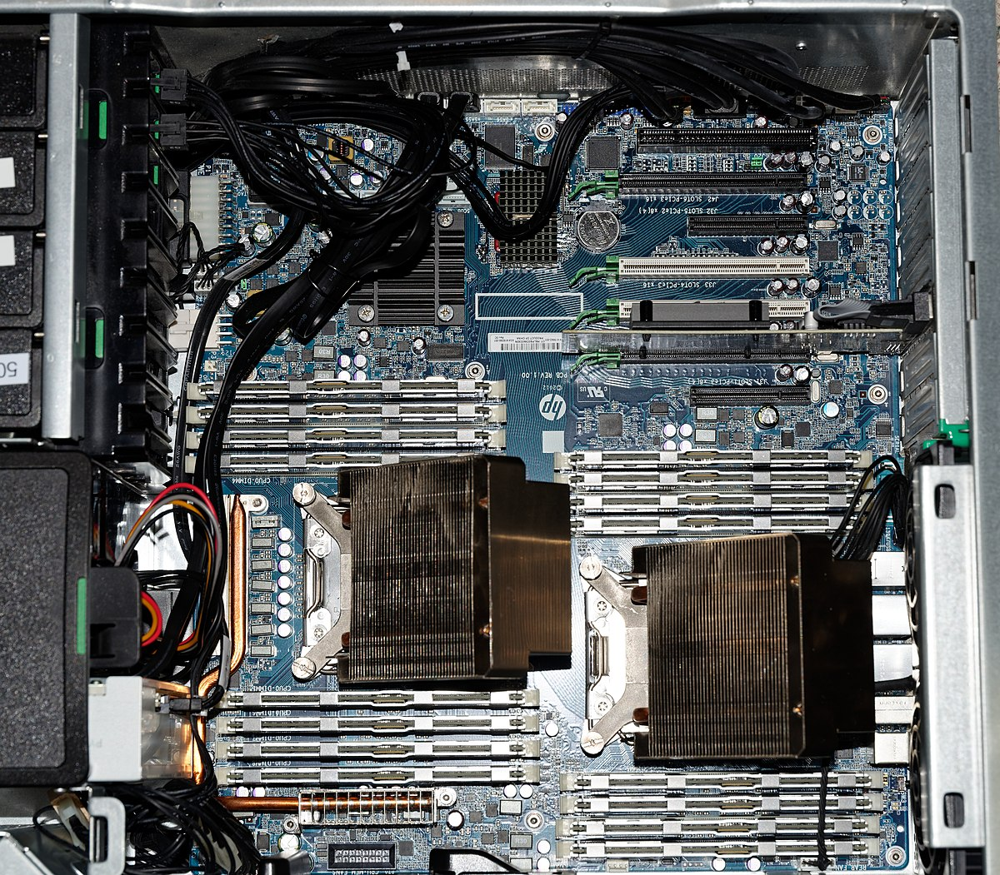
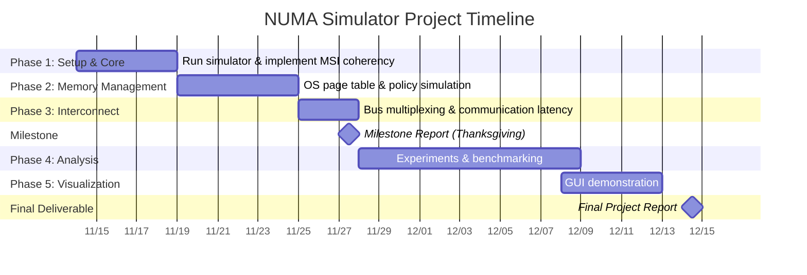

## Summary

We are going to implement a NUMA simulator and measure the latency in memory accesses under different interconnect network policies and page assignment. 

## BACKGROUND

Non-uniform memory access (NUMA) is an architecture for multiprocessing, where each chiplet (CPU) can access its own local memory faster than non-local memory. NUMA helps for scaling because it avoids bandwidth bottlenecks of single shared interconnect.  

*Figure 1: NUMA Architecture - Abstract View*

While we have covered NUMA conceptually in lectures, we have not yet explored its practical implementation. We believe a hands-on study of NUMA's design—and how it overcomes the scaling limitations of SMP—would be highly valuable. Furthermore, this architecture introduces new challenges, such as the need for locality-aware memory management and scheduling, which warrant further investigation.

*Figure 2: Real-world NUMA System Implementation*

## THE CHALLENGE

The project is challenging in its implementation. We want to be able to simulate NUMA that's valuable and representative of real-world architecture to an extent. Through this, we want to gain a deeper understanding of cache coherence protocol, interconnect topology, and lastly NUMA architecture itself.   

To implement NUMA, we want to simulate some interconnect that allows memory requests on different addresses to be executed in parallel, and simulate the longer latency of performing remote accesses through this interconnect module.   

Another challenge would be benchmarking. We want to be able to run different traces, and reason through the memory access latency under different workloads. The interaction between cache coherence, interconnect, and NUMA page policy would be interesting to explore.  

## RESOURCES

We asked Prof. Railing to share the [15-346 starter code](https://github.com/bprail/cadss_public), which includes a reference processor and cache simulator. Prof. Railing will also advise us on our project.  

The starter code implements MI cache coherence protocol and a serial bus. The cache coherence protocol currently does not handle evictions.   

We likely will ask help from Prof. Railing to obtain different kinds of memory traces to run against our simulator and collect metrics based on those. We plan to develop on andrew linux machines. The trace will be in the format of \<load or a store, virtual address, processor\_id\>.

## GOALS AND DELIVERABLES

The final form of the simulator should be representative of the real-world architecture enough for us to draw effective conclusions about memory access latency in modern NUMA architectures. It should be able to take in memory requests, correctly run through underlying cache coherence protocol and interconnect configuration, and output the latency of these memory requests. 

### Should have:

- A working cache coherence protocol that does MSI and handles evictions.   
- A multiplexing bus that can serve intra-node and inter-node memory requests in parallel.  
- A simulation of OS page tables that translate virtual addresses to physical addresses.  
- A simulation of OS page assignment policy that is predetermined.  
- Model the latency of local accesses versus remote accesses.

### Might have:

- Extend the interconnect to be more than just a bus and experiment with different interconnect topologies and networking policies.  
- Experiment with different OS page assignment policies  
- A GUI demo that consumes a log of our simulator running and showcases the memory latency and steps happening after a memory request. 

### Analysis of workload

- Study the memory access latency of different memory requests pattern in different workload  
- We want to answer the question of how the interaction between cache coherence, interconnect topology, and locality of accesses affect the access latency. 

### Demo:

- Detailed analysis and report of memory access latency under different workloads  
- (Might have): GUI demo mentioned above

## PLATFORM CHOICE

Given that we will be building upon the CADASS platform, C/C++ is our selected development language. A key benefit of this platform is the ability to leverage pre-existing utilities (such as `refCache` and `refProcessor`), which reduces our implementation overhead. This allows us to focus on the unique complexities introduced by NUMA. All experiments will be run on GHC machines.

## SCHEDULE

### Detailed Timeline

| Timeline | Tasks | Status |
|----------|-------|--------|
| 11/14-11/18 | Run simulator & implement MSI coherency | 🔄 In Progress |
| 11/19-11/24 | OS page table & policy simulation | ⏳ |
| 11/25-11/27 | Bus multiplexing & communication latency | ⏳ |
| **11/27** | **🎯 Milestone Report** (Thanksgiving) | ⏳ |
| 11/28-12/8 | Experiments & benchmarking | ⏳ |
| 12/8-12/12 | GUI demonstration | ⏳ |
| **12/13-12/15** | **🎯 Final Project Report** | ⏳ |

